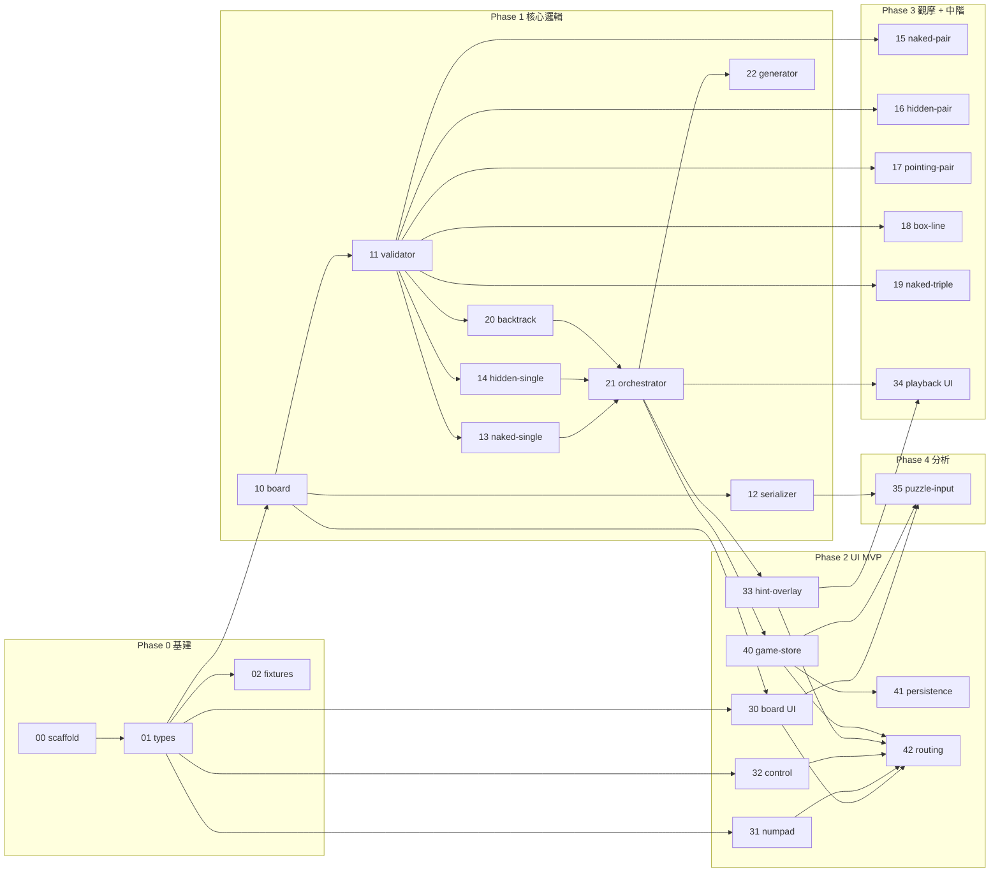

# 數獨學習工具 — 主 Plan

## 一、產品定位

幫助使用者學習數獨解題的 Web 工具，包含三種模式：

| 模式 | 說明 |
|---|---|
| **遊戲模式** | 玩家自己解題，卡住時可呼叫「提示」顯示下一步該填哪格 + 用什麼技巧 + 為什麼 |
| **觀摩模式** | 玩家觀看電腦完整解題過程（手動 / 自動播放），每步附技巧說明 |
| **分析模式** | 玩家輸入任意盤面，電腦分析難度並列出解題路徑 |

## 二、技術棧

- 前端：Vue 3 + Vite + TypeScript
- 狀態：Pinia
- 測試：Vitest + Vue Test Utils
- Lint / Format：ESLint + Prettier
- Package manager：pnpm
- 純前端（無後端），進度存 localStorage

## 三、功能範圍

### 解題技巧涵蓋（基礎 + 中階）
- Naked Single（裸單）
- Hidden Single（隱單）
- Naked Pair / Hidden Pair（裸對 / 隱對）
- Naked Triple（裸三）
- Pointing Pair（指向對）
- Box/Line Reduction（區塊行列消除）
- Backtrack（暴力回溯）— 僅作為 fallback 保底解題，不出提示訊息

### 難度分級（生成器依此分級）
| 難度 | 解出所需技巧 |
|---|---|
| 簡單 | 僅 Naked Single |
| 中等 | + Hidden Single |
| 困難 | + Naked/Hidden Pair、Pointing Pair |
| 專家 | + Triple、Box/Line Reduction（用滿所有中階技巧） |

### 題目來源
- 演算法即時生成
- 使用者手動輸入盤面（含 81 字串貼上）

## 四、Phase 與任務清單

### Phase 0：基建（序列執行）
| ID | 檔案 | 狀態 | 負責 | 說明 |
|---|---|---|---|---|
| 00 | [tasks/00-scaffold.md](tasks/00-scaffold.md) | 🟢 done | cursor-gpt | 專案骨架（Vite + Vue + TS + Vitest） |
| 01 | [tasks/01-shared-types.md](tasks/01-shared-types.md) | 🟢 done | cursor-gpt | 共享型別契約（子任務間介面） |
| 02 | [tasks/02-test-fixtures.md](tasks/02-test-fixtures.md) | 🟢 done | cursor-gpt | 測試題目集 |

### Phase 1：核心邏輯 MVP
| ID | 檔案 | 狀態 | 負責 | 依賴 |
|---|---|---|---|---|
| 10 | [tasks/10-board-core.md](tasks/10-board-core.md) | 🟢 done | claude-code | 01 |
| 11 | [tasks/11-validator.md](tasks/11-validator.md) | 🟢 done | claude-code | 01, 10 |
| 12 | [tasks/12-serializer.md](tasks/12-serializer.md) | 🟢 done | claude-code | 01, 10 |
| 13 | [tasks/13-tech-naked-single.md](tasks/13-tech-naked-single.md) | 🟢 done | claude-code | 10, 11 |
| 14 | [tasks/14-tech-hidden-single.md](tasks/14-tech-hidden-single.md) | 🟢 done | claude-code | 10, 11 |
| 20 | [tasks/20-solver-backtrack.md](tasks/20-solver-backtrack.md) | 🟢 done | claude-code | 10, 11 |
| 21 | [tasks/21-solver-orchestrator.md](tasks/21-solver-orchestrator.md) | 🟢 done | claude-code | 13, 14, 20 |
| 22 | [tasks/22-puzzle-generator.md](tasks/22-puzzle-generator.md) | todo | - | 20, 21 |

### Phase 2：UI MVP（遊戲模式可玩）
| ID | 檔案 | 狀態 | 負責 | 依賴 |
|---|---|---|---|---|
| 30 | [tasks/30-ui-board.md](tasks/30-ui-board.md) | todo | - | 01, 10 |
| 31 | [tasks/31-ui-numberpad.md](tasks/31-ui-numberpad.md) | todo | - | 01 |
| 32 | [tasks/32-ui-controlpanel.md](tasks/32-ui-controlpanel.md) | todo | - | 01 |
| 33 | [tasks/33-ui-hint-overlay.md](tasks/33-ui-hint-overlay.md) | todo | - | 01, 21 |
| 40 | [tasks/40-store-game.md](tasks/40-store-game.md) | todo | - | 10, 21 |
| 41 | [tasks/41-store-persistence.md](tasks/41-store-persistence.md) | todo | - | 40 |
| 42 | [tasks/42-routing-mode.md](tasks/42-routing-mode.md) | todo | - | 30-33, 40 |

### Phase 3：觀摩模式 + 中階技巧
| ID | 檔案 | 狀態 | 負責 | 依賴 |
|---|---|---|---|---|
| 15 | [tasks/15-tech-naked-pair.md](tasks/15-tech-naked-pair.md) | todo | - | 10, 11 |
| 16 | [tasks/16-tech-hidden-pair.md](tasks/16-tech-hidden-pair.md) | todo | - | 10, 11 |
| 17 | [tasks/17-tech-pointing-pair.md](tasks/17-tech-pointing-pair.md) | todo | - | 10, 11 |
| 18 | [tasks/18-tech-box-line-reduction.md](tasks/18-tech-box-line-reduction.md) | todo | - | 10, 11 |
| 19 | [tasks/19-tech-naked-triple.md](tasks/19-tech-naked-triple.md) | todo | - | 10, 11 |
| 34 | [tasks/34-ui-playback-panel.md](tasks/34-ui-playback-panel.md) | todo | - | 21, 33 |

### Phase 4：分析模式
| ID | 檔案 | 狀態 | 負責 | 依賴 |
|---|---|---|---|---|
| 35 | [tasks/35-ui-puzzle-input.md](tasks/35-ui-puzzle-input.md) | todo | - | 12, 30, 40 |

## 五、依賴圖（Mermaid）



## 六、子任務 YAML 契約規範

每個子 plan 檔開頭必有：

```yaml
---
id: <task-id>          # 任務唯一 ID（與檔名一致）
phase: P0|P1|P2|P3|P4
status: todo|wip|review|done|blocked
depends_on: [<id>, ...]
assignee: <agent-name> | null
estimated_complexity: S|M|L   # S=半天 M=1天 L=2天+
acceptance:
  - "<驗收項目 1>"
  - "<驗收項目 2>"
deliverables:
  - "<檔案路徑>"
---
```

## 六-B 派工流程（A 方案：CC 主 agent + Cursor/GPT 實作 subagent + 使用者信使）

### 角色分工
| 角色 | 工具 | 職責 |
|---|---|---|
| **主 agent** | Claude Code CLI | 規劃、決定派工順序、產生 Cursor prompt、驗收、維護 plan |
| **實作 subagent** | Cursor + GPT / Claude Sonnet | 依照 prompt 實作單一子任務、跑測試、回報結果 |
| **信使** | 使用者本人 | 在兩端之間複製貼上 prompt 與結果 |

### 派工循環（每個子任務）
```
1. CC 讀子 plan YAML
     ├─ 檢查 depends_on 是否全 done
     ├─ 檢查 status=todo
     └─ 設 status=wip + assignee=cursor-gpt

2. CC 把派工 prompt **寫入** docs/plans/dispatch/{task-id}.prompt.md
   並告知使用者「派工 prompt 已就緒，去 Cursor 開新 chat 指過去這個檔案」

3. 使用者在 Cursor 開新 chat，附上 docs/plans/dispatch/{task-id}.prompt.md
4. Cursor (GPT / Claude Sonnet) 讀檔、實作、跑測試
5. Cursor **寫入** docs/plans/dispatch/{task-id}.report.md（完工回報）
6. 使用者告知 CC「{task-id} 完工」

7. CC 驗收：
     ├─ 讀 docs/plans/dispatch/{task-id}.report.md
     ├─ 跑 pnpm typecheck（透過 Bash 工具）
     ├─ 跑 pnpm test（對應子任務測試）
     ├─ 對照子 plan 的 acceptance 逐項打勾
     ├─ 檢查 src/types/ 是否被未授權修改
     └─ 通過 → status=done；未通過 → status=blocked，更新 prompt 檔案再循環

8. CC 更新本檔表格進度（status 圖示同步）
```

### 派工檔案慣例
| 檔案 | 寫入者 | 用途 |
|---|---|---|
| `docs/plans/tasks/{task-id}.md` | CC（規劃時建立） | 子任務規格（不可改） |
| `docs/plans/dispatch/{task-id}.prompt.md` | CC（派工時建立） | 給 Cursor 讀的派工 prompt |
| `docs/plans/dispatch/{task-id}.report.md` | Cursor（完工時建立） | Cursor 回報，給 CC 驗收用 |

### Git 操作分工
- **Cursor 不做任何 git 操作**：直接在 main 分支寫檔案 + 寫 report，**不 add / commit / push / 切分支 / 建 worktree**。
- **主 agent（CC）負責**：每個任務驗收通過後做一次 commit + push，commit message 結尾標 `[<task-id>]`，commit 順序就是任務完成順序。

### 並行派工
若 CC 同時派發 ≥ 2 個獨立任務：
- 每個任務一個獨立 Cursor chat（避免脈絡互相干擾）
- CC 為每個任務各輸出一份 prompt，附上「[Task A]」「[Task B]」標籤
- 驗收時逐個處理

## 七、Cursor 派工 Prompt Template

CC 每次派工輸出以下格式，使用者直接複製貼到 Cursor：

````md
# [Cursor 子任務 — {task-id}]

## 你的角色
你是專注的工程師，只負責這個獨立子任務。**不要超出範圍**：不要動其他檔案、不要重構無關邏輯、不要修改型別契約。

## 必讀脈絡
請依序讀完以下檔案再開始寫 code：
1. `docs/plans/tasks/{task-id}.md`  ← 本任務完整規格（重點：API spec、演算法、測試項目、acceptance）
2. `src/types/index.ts`  ← 共享型別契約（**唯讀，不可修改**）
3. `src/fixtures/`（若任務涉及測試 fixture）

## 任務目標
{從子 plan §目標 抓出 1-2 句}

## 必須產出的檔案
{從子 plan deliverables 列出，例：}
- `src/techniques/nakedSingle.ts`
- `src/techniques/nakedSingle.test.ts`

## API / 介面規格
{從子 plan §API 規格 或 §介面 完整貼上}

## 演算法 / 實作要點
{從子 plan §演算法 / §實作要點 貼上}

## 測試項目
{從子 plan §測試項目 貼上}

## 完工條件（驗收用）
{從子 plan acceptance 列出，逐條打勾用}
- [ ] {acceptance 1}
- [ ] {acceptance 2}
- [ ] `pnpm typecheck` 通過
- [ ] `pnpm test {對應路徑}` 全綠

## 規則（重要）
1. **不修改** `src/types/` 任何檔案。若你認為型別契約需要改，**停手回報**，不要自己改。
2. **不修改** `deliverables` 以外的檔案（orchestrator 註冊例外，會在 plan 中說明）。
3. **不加額外功能**：嚴格按本 prompt 範圍，不發揮、不預留擴充點。
4. **變數命名遵循專案規範**：camelCase，正向命名（如 `enabled` 而非 `isNotDisabled`）。
5. **每個 function 寫繁中註解**說明用途；複雜函式開頭列流程步驟。
6. **單檔超過 300 行**請拆檔。
7. **直接在 main 分支開工**：不要建 worktree、不要開新分支、不要做隔離。
8. **不要執行任何 git 操作**：不 `git add`、不 `git commit`、不 `git push`、不切換分支。**commit 與 push 一律由主 agent（Claude Code）負責**，你只寫檔案 + 寫 report。

## 完工回報格式
做完後，請回報以下內容（**整段複製給使用者**）：

```
[{task-id}] 完工回報
變更檔案：
  - <path1>
  - <path2>
測試結果：
  $ pnpm typecheck    → PASS / FAIL (錯誤摘要)
  $ pnpm test <path>  → X passed / Y failed
完工條件勾選：
  [x] {acceptance 1}
  [x] {acceptance 2}
  [x] pnpm typecheck 通過
  [x] pnpm test 全綠
一句話總結：<這個任務做了什麼>
（若有任何偏離規格 / 卡住 / 需要主 agent 決策的點，列在這裡）
```
````

### Prompt 輸出時機
CC 在派工時 **把上述 prompt 寫入 `docs/plans/dispatch/{task-id}.prompt.md`**，使用者只需在 Cursor 開新 chat 指過去該檔即可。

## 七-B 共享契約異動規則

**`src/types/`（由 `01-shared-types` 建立）是所有子任務的介面合約。若子任務發現需要修改型別契約：**

1. Cursor subagent 不可自行修改，必須在回報中標示「需修改契約」並停手
2. CC 主 agent 評估影響：列出所有受影響的已完成 / 進行中任務
3. CC 主 agent 親自修改契約檔（或開新子任務派工修改），完成後在本 plan 記錄一筆「契約異動紀錄」
4. 對所有受影響、已完成的任務重新派工驗收（重跑 typecheck / test）

### 契約異動紀錄
| 日期 | 異動內容 | 影響任務 | 處理結果 |
|---|---|---|---|
| - | - | - | - |

## 八、並行度建議

主 agent 建議同時派發子任務數 **2-3 個**：
- 過多 Cursor chat 視窗難管理（你是信使，要在多個 chat 間切換）
- 每個 chat 的回報內容貼回 CC 都要花脈絡
- 2-3 個是「省 CC 額度」與「使用者操作負擔」的平衡點

可並行批次範例：
- **P1 批次 A**：10 (board) → 完成後 11 + 12 並行
- **P1 批次 B**：13 + 14 + 20 並行（皆依賴 11）
- **P2 批次**：30 + 31 + 32 + 33 並行
- **P3 批次**：15 + 16 + 17 + 18 + 19 並行（最佳並行區塊）

## 九、整合驗收項（每階段結束）

### P1 整合驗收
- `pnpm test` 全綠
- 可由 81 字串建立 Board → 套用 orchestrator → 解出（用 fixture 中 5 題簡單 + 5 題中等）
- 解題輸出 step 序列含技巧名稱與中文說明

### P2 整合驗收
- 啟動後可進入遊戲模式、選難度、開始新局
- 鉛筆模式、衝突顯示、undo/redo、清除單格全部可用
- 按提示按鈕顯示下一步技巧推薦 + 高亮 + 中文說明
- 重新整理頁面進度保留

### P3 整合驗收
- 可進入觀摩模式，看到完整解題步驟（手動 / 自動播放可切換）
- 困難 / 專家難度可生成並由 orchestrator 解出
- 每步技巧高亮 + 推理說明顯示無誤

### P4 整合驗收
- 可貼上 81 字串或手動輸入盤面進入分析模式
- 系統回報盤面難度與完整解題路徑

## 十、Status 圖示
- `todo` ⚪ 未開始
- `wip` 🟡 進行中
- `review` 🟣 待驗收
- `done` 🟢 已完工
- `blocked` 🔴 被擋
